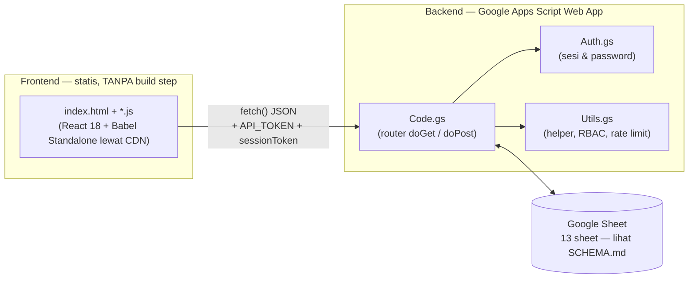

# SIGAP — Sistem Informasi Gerbang & Absensi Pelanggaran

[](https://github.com/akunsyarif-rgb/Sigap-app/actions/workflows/test.yml)

Aplikasi web internal **SMAN 2 Tarakan** untuk mencatat keterlambatan siswa,
surat izin/sakit, izin keluar/pulang di tengah jam pelajaran (BETA),
pelanggaran tata tertib, dan pelanggaran saat upacara — menggantikan buku
piket kertas dengan satu sistem yang bisa dicari dan direkap kapan saja.

Untuk panduan pemakaian versi non-teknis (ditujukan ke guru/kepala
sekolah), lihat **[docs/PANDUAN-FITUR-DAN-ALUR-KERJA.md](docs/PANDUAN-FITUR-DAN-ALUR-KERJA.md)**.
Untuk struktur data Google Sheet secara lengkap (nama sheet + urutan
kolom persis), lihat **[SCHEMA.md](SCHEMA.md)**.
Untuk catatan teknis mendalam (alasan di balik tiap keputusan desain,
kebijakan deploy, dsb.), lihat **[CLAUDE.md](CLAUDE.md)**.

## Arsitektur Singkat

SIGAP punya **dua bagian yang di-deploy secara terpisah** dan **tidak saling
otomatis** — ini poin paling penting untuk dipahami sebelum menyentuh kode:



| | Frontend (`index.html`, `*.js`) | Backend (`Code.gs`, `Auth.gs`, `Utils.gs`) |
|---|---|---|
| Hosting | Situs statis (Vercel) | Google Apps Script Web App, terikat ke satu Google Sheet |
| Deploy saat push ke `main` | **Otomatis** | **Tidak pernah otomatis** — wajib `clasp` manual atau salin-tempel ke editor Apps Script, lihat [CLAUDE.md](CLAUDE.md#clasp-apps-script-cli) |
| Database | — (tidak menyimpan state) | Google Sheet itu sendiri (`SpreadsheetApp`) |

Alur singkat: browser memuat `index.html`, yang men-`fetch()` seluruh file
`.js` lain secara berurutan, menggabungkannya, lalu mentranspile JSX-nya
lewat Babel **di browser** (tidak ada bundler). Setiap aksi (login, catat
data, dst.) dikirim sebagai `fetch()` JSON ke satu Web App URL yang sama,
digembok token API + sesi guru yang login.

## Fitur Utama

- **Gerbang**: catat keterlambatan & surat izin/sakit, termasuk Izin
  Keluar/Pulang di tengah jam pelajaran (BETA) — perorangan maupun
  rombongan (Izin Kelompok).
- **Pelanggaran**: catat pelanggaran tata tertib + sanksi, dan pelanggaran
  saat upacara (dicatat OSIS/BK/Admin).
- **Bimbingan Khusus**: catatan konseling, dibatasi ketat untuk BK/Admin.
- **Rekap Kelas, Statistik**: rekap per kelas untuk wali kelas/BK/Admin.
- **Export Data**: unduh laporan PDF/Excel tanpa perlu akses ke Google
  Sheet-nya langsung.
- **Kelola (Admin)**: kelola akun guru, jadwal piket, dan Pemeliharaan
  Data (hapus data operasional lama per rentang tanggal, dengan pratinjau
  wajib sebelum eksekusi).
- **Audit Log**: jejak siapa melakukan apa, khusus Admin.
- **Ganti Password sendiri**: semua peran bisa mengganti password akunnya
  sendiri tanpa perlu minta admin reset.

Rincian tiap fitur (siapa boleh apa, alur kerja lengkap) ada di
[docs/PANDUAN-FITUR-DAN-ALUR-KERJA.md](docs/PANDUAN-FITUR-DAN-ALUR-KERJA.md).

## Menjalankan & Menguji Secara Lokal

Repo ini **tidak punya build step** untuk frontend (lihat komentar di
`index.html`), dan backend-nya adalah Google Apps Script — bukan server
Node yang bisa dijalankan begitu saja secara lokal. Yang bisa dilakukan
sepenuhnya secara lokal adalah **menjalankan test suite**:

```bash
npm install       # sekali, untuk @babel/core + @babel/preset-react (test) & clasp
npm test          # menjalankan seluruh test (node --test tests/*.test.js)
```

Test suite ini memuat `Utils.gs`/`Auth.gs`/`Code.gs` yang **sungguhan**
lewat `vm.runInContext` dengan layanan Apps Script (`SpreadsheetApp`,
`CacheService`, dst.) di-stub — jadi yang diuji benar-benar logika backend
yang nanti berjalan di Apps Script, bukan tiruannya. Untuk menjalankan satu
file test saja:

```bash
node --test tests/password.test.js
node --test tests/hapus-data.test.js
```

Untuk melihat **tampilan frontend** secara utuh (bukan sekadar test), perlu
backend yang benar-benar hidup:

1. Buat Google Sheet baru dengan sheet & kolom sesuai [SCHEMA.md](SCHEMA.md).
2. Buat project Apps Script terikat ke Sheet itu, isi `Code.gs`/`Auth.gs`/`Utils.gs`,
   set `API_TOKEN` di Script Properties, lalu deploy sebagai Web App
   (lihat bagian clasp di [CLAUDE.md](CLAUDE.md#clasp-apps-script-cli)).
3. Salin `.clasp.json.example` → `.clasp.json`, isi `scriptId` project Anda
   (dipakai `clasp`, bukan dibaca browser).
4. Ubah `API_URL`/`API_TOKEN` di `config.js` supaya menunjuk ke Web App
   Anda sendiri, lalu buka `index.html` lewat static server pilihan Anda
   (mis. `npx serve .`) — **jangan** buka lewat `file://` langsung, sebagian
   browser memblokir `fetch()` dari origin `file://`.

## Struktur Repo Singkat

```
Code.gs, Auth.gs, Utils.gs   backend (Google Apps Script)
index.html, *.js             frontend (React tanpa bundler)
tests/                       test backend (vm.runInContext) & smoke-test render frontend
docs/                        panduan fitur untuk pengguna non-teknis
.github/workflows/           CI (test.yml), deploy backend manual (deploy-gas.yml),
                              & deteksi drift versi backend (check-backend-drift.yml)
SCHEMA.md                    struktur lengkap 13 sheet Google Sheet
```
